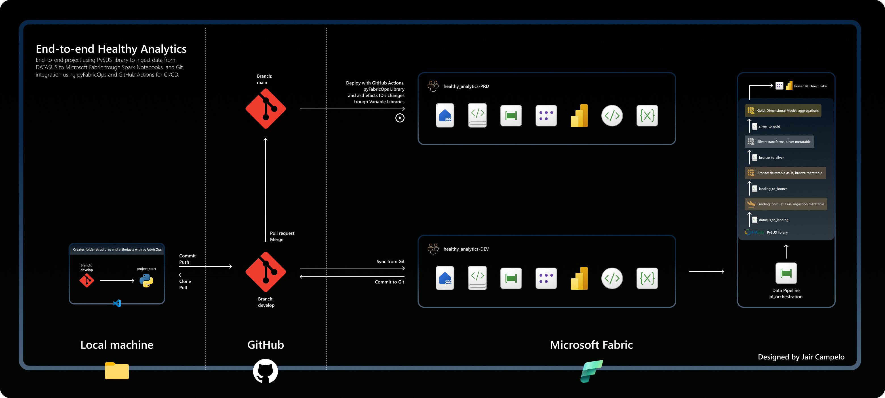

# End-to-end Healthy Analytics
Projeto end-to-end utilizando a biblioteca PySUS para ingerir dados do DATASUS no Microsoft Fabric por meio de Notebooks, com integração ao Git usando pyFabricOps e GitHub Actions para CI/CD.

## Objetivos

Este projeto foi desenvolvido com o objetivo de aprimorar minhas habilidades como Analytics Engineer, abordando temas como: Arquitetura Medalhão, CI/CD, integração com Git, linguagens Python e PySpark, ETL/ELT, Visualização de Dados, Modelagem de Dados, Orquestração de Dados com Pipelines e Notebooks, utilização de Delta Tables, monitoramento de metadados e, por que não, um pouco de inglês para fins de documentação.

## Visão Geral do Projeto

O resultado deste projeto end-to-end é um relatório sobre Crescimento Natural da População, que representa a diferença entre as taxas de natalidade e mortalidade. Além disso, esses dados são cruzados com a cobertura assistencial em cada região, ampliando a capacidade de tomada de decisão de autoridades institucionais e/ou do setor privado.

Os dados utilizados foram obtidos via Python, por meio de uma biblioteca pública chamada PySUS, que requisita os dados do DATASUS — um banco de dados do Sistema Único de Saúde (SUS) — e os entrega em dataframes pandas ou arquivos parquet.

A integração com o Git foi configurada entre minha máquina local, um repositório no GitHub e o Microsoft Fabric utilizando múltiplas fontes:

- Biblioteca pyFabricOps: uma **biblioteca Python para operações no Microsoft Fabric (e Power BI), fornecendo uma interface simples para as APIs REST oficiais do Fabric. Utiliza as APIs REST do Power BI como fallback quando necessário. Projetada para rodar em notebooks Python, scripts Python puros ou integrada a fluxos de trabalho baseados em YAML para CI/CD** e pode ser acessada no [GitHub](https://github.com/alisonpezzott/pyfabricops)
- GitHub Actions: uma plataforma de Integração Contínua e Entrega Contínua (CI/CD) que permite automatizar pipelines de build, teste e deploy, criando fluxos de trabalho que constroem e testam cada pull request do repositório ou fazem o deploy de pull requests mesclados para produção.
- Integração Git do Microsoft Fabric: permite que desenvolvedores integrem seus processos de desenvolvimento, ferramentas e boas práticas diretamente na plataforma Fabric, possibilitando a colaboração entre equipes ou o trabalho individual com Git branches.

Dentro do Microsoft Fabric, Notebooks foram utilizados para Extração, Carga e Transformação dos dados (ELT), que foram armazenados em um único Lakehouse.

A orquestração de dados deste projeto foi definida seguindo o modelo de Arquitetura Medallion, que consiste em dividir o caminho percorrido pelos dados em estágios, comumente chamados de Bronze, Silver e Gold. Neste projeto, foi adicionado mais um estágio no início:

| Estágio | Descrição |
|---|---|
| **Landing** | Onde os dados são extraídos do DATASUS no formato original e armazenados no Lakehouse em arquivos parquet |
| **Bronze** | Os dados contidos nos arquivos extraídos são convertidos no formato original para Delta Tables por meio de Notebooks |
| **Silver** | Aplica boas práticas de nomenclatura, trata nulos, altera schemas e realiza outras transformações |
| **Gold** | Cria o Modelo Dimensional e agrega os dados para reduzir o tamanho do modelo, visando melhor desempenho e resposta às perguntas de negócio |

## Tech Stack

- Microsoft Fabric
- PySpark
- Python
- Bibliotecas PySUS e pyFabricOps
- GitHub
- GitHub Actions
- VS Code
- Figma
- Power BI
- Direct Lake Model

## Licença

[MIT](LICENSE) © 2026 Jair Campelo